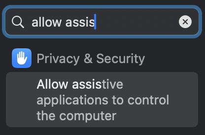

chatgpt on macos has a paste limit that's lower than the number of characters that can be sent in the message. this script buffers pasting the input, and is set up to catch cmd-v. it requires karabiner elements.

setup:

1. Run `./setup.sh`. Requires sudo to copy the script to /usr/local/bin, but it can go somewhere else if you want.
2. Grant osascript and karabiner elements permissions needed to paste:

Open accessibility settings:

Click the "+", CMD-Shift-G to navigate to and select `/usr/bin/osascript` and `/Library/Application Support/org.pqrs/Karabiner-Elements/bin/karabiner_console_user_server`

Then it should be good to go.